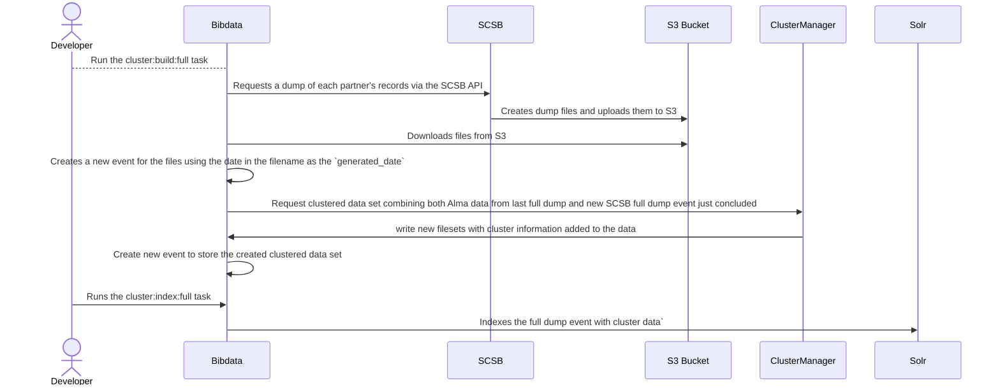
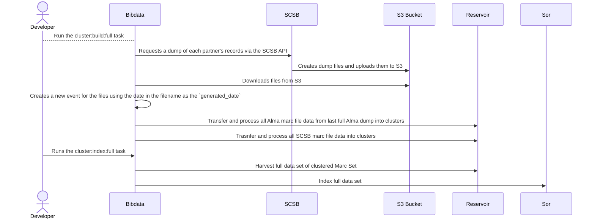
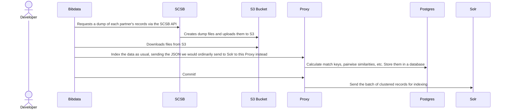

```mermaid
sequenceDiagram
    accTitle: Full Indexing using a clustered data set
    accDescr {
        Indexing process including clustering.
    }
    actor Developer
    Developer-->Bibdata: Run the cluster:build:full task
    Bibdata->>SCSB: Requests a dump of each partner's records via the SCSB API
    SCSB->>S3 Bucket: Creates dump files and uploads them to S3
    Bibdata->>S3 Bucket: Downloads files from S3
    Bibdata->>Bibdata: Creates a new event for the files using the date in the filename as the `generated_date`
    Bibdata->>ClusterManager: Request clustered data set combining both Alma data from last full dump and new SCSB full dump event just concluded
    ClusterManager->>Bibdata: write new filesets with cluster information added to the data
    Bibdata->>Bibdata: Create new event to store the created clustered data set
    Developer->>Bibdata: Runs the cluster:index:full task
    Bibdata->>Solr: Indexes the full dump event with cluster data`

```

Alternative Process using Reservoir

```mermaid
sequenceDiagram
    accTitle: Full Indexing using a clustered data set managed by Reservoir
    accDescr {
        Indexing process including clustering.
    }
    actor Developer
    Developer-->Bibdata: Run the cluster:build:full task
    Bibdata->>SCSB: Requests a dump of each partner's records via the SCSB API
    SCSB->>S3 Bucket: Creates dump files and uploads them to S3
    Bibdata->>S3 Bucket: Downloads files from S3
    Bibdata->>Bibdata: Creates a new event for the files using the date in the filename as the `generated_date`
    Bibdata->>Reservoir: Transfer and process all Alma marc file data from last full Alma dump into clusters
    Bibdata->>Reservoir: Trasnfer and process all SCSB marc file data into clusters
    Developer->>Bibdata: Runs the cluster:index:full task
    Bibdata->>Reservoir: Harvest full data set of clustered Marc Set
    Bibdata->>Sor: Index full data set

```

Another idea: A proxy server in front of solr

```mermaid
sequenceDiagram
    accTitle: Full Indexing using a proxy server in front of solr
    accDescr {
        Indexing process including clustering.
    }
    actor Developer
    Bibdata->>SCSB: Requests a dump of each partner's records via the SCSB API
    SCSB->>S3 Bucket: Creates dump files and uploads them to S3
    Bibdata->>S3 Bucket: Downloads files from S3
    Bibdata->>Proxy: Index the data as usual, sending the JSON we would ordinarily send to Solr to this Proxy instead
    Proxy->>Postgres: Calculate match keys, pairwise similarities, etc.  Store them in a database
    Bibdata->>Proxy: Commit!
    Proxy->>Solr: Send the batch of clustered records for indexing

```

