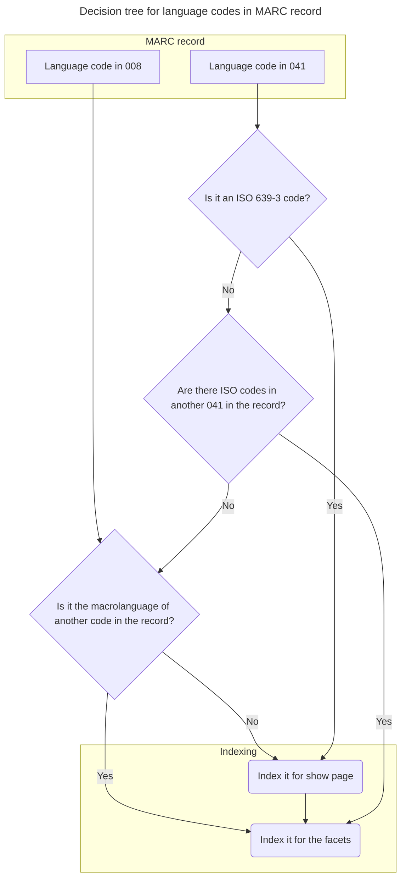

# Languages indexed by bibdata

## Language codes

There are several standards for representing human languages.  Bibdata concerns itself with the language codes from the following standards:
* IANA Language Subtag Registry
* MARC codes for languages (which is largely the same as ISO 639-2)
* ISO 639-3
* ISO 639-5 (collective language codes)

These standards have various levels of overlap, as discussed in the following table:

<!-- Using HTML in this table to add row headers and a caption, which are not included in Github-flavored markdown -->
<table aria-label="Codes and other data included in language standards">
    <caption>Codes and other data included in language standards</caption>
    <thead>
        <tr>
            <th scope="col">Codes</th>
            <th scope="col">Included in MARC codes?</th>
            <th scope="col">Included in ISO 639-3?</th>
            <th scope="col">Included in ISO 639-5?</th>
        </tr>
    </thead>
    <tbody>
        <tr>
            <th scope="row">Basic list of over 400 codes</th>
            <td>Yes</td>
            <td>Yes</td>
            <td>No</td>
        </tr>
        <tr>
            <th scope="row">Extended list of 7500 additional codes</th>
            <td>No</td>
            <td>Yes</td>
            <td>No</td>
        </tr>
        <tr>
            <th scope="row">List of collective codes</th>
            <td>Yes, but different from ISO 639-5 codes</td>
            <td>No</td>
            <td>Yes, but different from MARC codes</td>
        </tr>
        <tr>
            <th scope="row">Mappings of individual languages to Macrolanguages</th>
            <td>No</td>
            <td>Yes</td>
            <td>No</td>
        </tr>
    </tbody>
</table>

## Language codes in MARC records

MARC codes and ISO 639-3 codes may be found in MARC records, as described in the following table.  IANA codes are not in MARC records, so we compute those ourselves.

<!-- Using HTML in this table to add row headers and a caption, which are not included in Github-flavored markdown -->
<table aria-label="Language codes included in MARC records">
    <caption>Language codes included in MARC records</caption>
    <thead>
        <tr>
            <th scope="col">Type of language code</th>
            <th scope="col">Used in 008 field</th>
            <th scope="col">Used in 041 field</th>
        </tr>
    </thead>
    <tbody>
        <tr>
            <th scope="row">MARC</th>
            <td>Yes</td>
            <td>Yes</td>
        </tr>
        <tr>
            <th scope="row">ISO 639-3</th>
            <td>No</td>
            <td>Yes, but needs 2nd indicator=<code>7</code> and <code>$2iso639-3</code></td>
        </tr>
    </tbody>
</table>

## Solr fields

Language data is stored in the following solr fields.  In general, the `language_facet` field will contain the most languages, to provide patrons with additional access points.  The `language_name_display` is intended for the show page, where we instead want to display only the most specific language information we have.

<!-- Using HTML in this table to add row headers and a caption, which are not included in Github-flavored markdown -->
<table aria-label="Language-related Solr fields">
    <caption>Language-related Solr fields</caption>
    <thead>
        <tr>
            <th scope="col">Solr field</th>
            <th scope="col">Where in the catalog is it used?</th>
            <th scope="col">Purpose</th>
        </tr>
    </thead>
    <tbody>
        <tr>
            <th scope="row"><code>language_facet</code></th>
            <td>Facets</td>
            <td>Provide many relevant language access points</td>
        </tr>
        <tr>
            <th scope="row"><code>language_name_display</code></th>
            <td>Show page (pending)</td>
            <td>Show only the most specific language information</td>
        </tr>
        <tr>
            <th scope="row"><code>language_iana_s</code></th>
            <td>Show page (not displayed to user)</td>
            <td>Inform screen readers which language pack to use when reading catalog record</td>
        </tr>
        <tr>
            <th scope="row"><code>mult_languages_iana_s</code></th>
            <td>JSON-LD</td>
            <td>Pass the data on to Figgy</td>
        </tr>
        <tr>
            <th scope="row"><code>language_display</code></th>
            <td>Show page</td>
            <td>Additional notes about the languages provided by catalogers (MARC 546 field)</td>
        </tr>
    </tbody>
</table>

### Decision tree

## Further reading

* [PCC guidelines for the use of ISO 639-3 language codes in MARC records](https://loc.gov/aba/pcc/scs/documents/ISO-639-3-guidelines.pdf)
