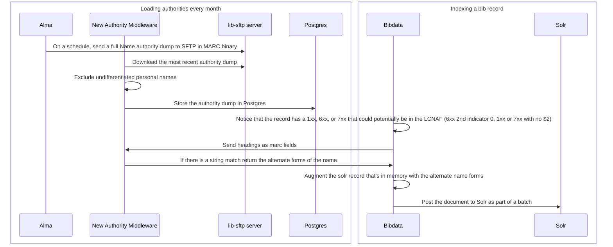

```mermaid
sequenceDiagram
    box Loading authorities every month
      participant Alma
      participant A as New Authority Middleware
      participant SFTP as lib-sftp server
      participant Postgres
    end
    box Indexing a bib record
      participant Bibdata
      participant S as Solr
    end
        Alma->>SFTP: On a schedule, send a full Name authority dump to SFTP in MARC binary
        A->>SFTP: Download the most recent authority dump
        A->>A:Exclude undifferentiated personal names
        A->>Postgres: Store the authority dump in Postgres

        Bibdata->>Bibdata: Notice that the record has a 1xx, 6xx, or 7xx that could potentially be in the LCNAF (6xx 2nd indicator 0, 1xx or 7xx with no $2)
        Bibdata->>A:Send headings as marc fields
        A->>Bibdata:If there is a string match return the alternate forms of the name
        Bibdata->>Bibdata: Augment the solr record that's in memory with the alternate name forms
        Bibdata->>S: Post the document to Solr as part of a batch

```
