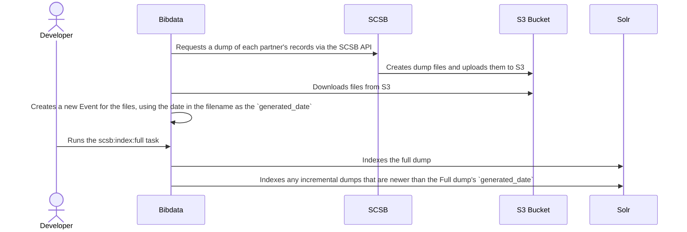

### SCSB Full Re-index Process

As illustrated in the diagram below, here are the steps of a full index of SCSB records:

* Bibdata requests a dump of each partner's records via the SCSB API
* SCSB creates dump files and uploads them to S3
* Bibdata downloads files from S3
* Bibdata creates a new Event for the files, using the
[date in the filename as the `generated_date`](https://github.com/pulibrary/bibdata/blob/fe7e6068502e86bb99d6094f76c72c4175dbdcd7/app/models/scsb/partner_updates.rb#L39-L42).
This date corresponds to the date that bibdata first requested the dump via the API.
* A developer then runs the `scsb:index:full` task
* Bibdata indexes the full dump into Solr.
* Bibdata indexes any incremental dumps that are newer than the Full dump's `generated_date`.

