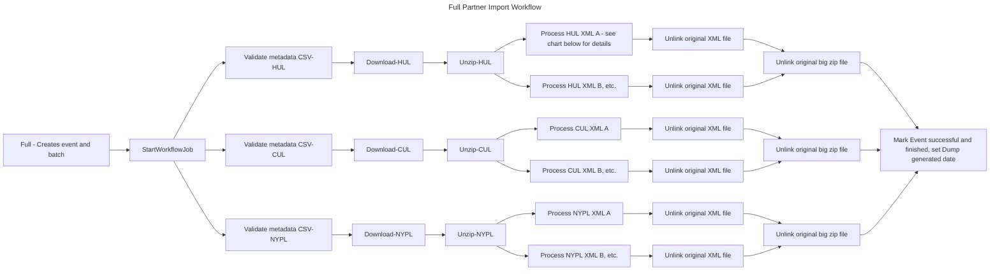
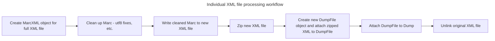

### Fetch and process the SCSB files into dump files

SSH to a bibdata machine as deploy user (Find a worker machine in your [environment](https://github.com/pulibrary/bibdata/tree/main/config/deploy)).
```
$ tmux attach-session -t full-index
$ cd /opt/bibdata/current
$ bundle exec rake scsb:import:full
CTRL+b d (to detach from tmux)
```
This kicks off an import job which will return immediately.  This can be monitored in [sidekiq busy queue](https://bibdata.princeton.edu/sidekiq/busy) or [sidekiq waiting queue](https://bibdata.princeton.edu/sidekiq/queues/default)

Takes 11-12 hours to complete. As they download and unpack they will be placed
in `/tmp/updates/` and as they are processed they will be moved to `/data/bibdata_files/scsb_update_files/`; you can follow the progress by listing the files in these directories.  You can also find the most recent Full Partner ReCAP Records from [the events page](https://bibdata.princeton.edu/events), and look at the dump files in its json.  Be sure not to deploy bibdata in the middle of this job, or else the job will have to start all over again from the beginning.

### Workflow
#### Full workflow
The `Import::Partners::Full` job kicks off the `StartWorkflowJob`, which creates an Event and a Dump, and sets off an individual workflow for each institution.

For each institution (Harvard University Libraries, Columbia University Libraries, New York Public Library), we download the Zip file from the SCSB Amazon S3 bucket, unzip the files, and then process each individual XML file from the big Zip file we downloaded. That individual XML file processing is detailed in the next section.

Once all of the unzipped files are finished being processed, we unlink the downloaded Zip file, then mark the overall Event as successful and finished, and set the Dump generated date.



#### Individual file processing workflow
For each individual XML file from the large zip file described in the section above, we create a MARC::XMLReader object using the XML file, run a series of fixes on each record in the XML file, then write the cleaned Marc records to a new XML file. We then zip the new XML file, and attach the zipped zml file to a new DumpFile object, which is attached to the Dump for the overall Event. Finally, we unlink the original XML file.

