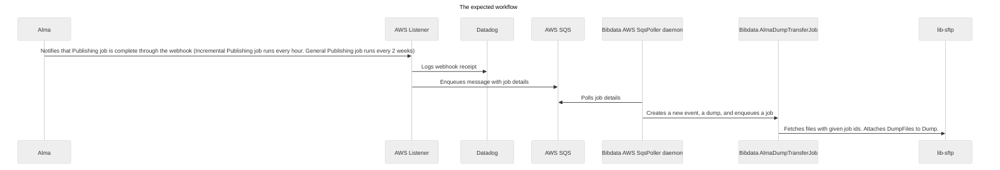

```mermaid
---
title: The expected workflow
---
sequenceDiagram
%%{init: {'theme': 'neutral', 'themeVariables': {'background': '#aaa'}}}%%
    Alma->>AWS Listener: Notifies that Publishing job is complete through the webhook (Incremental Publishing job runs every hour. General Publishing job runs every 2 weeks)
    AWS Listener->>Datadog: Logs webhook receipt 
    AWS Listener->>AWS SQS: Enqueues message with job details
    Bibdata AWS SqsPoller daemon->>AWS SQS: Polls job details   
    Bibdata AWS SqsPoller daemon->>Bibdata AlmaDumpTransferJob: Creates a new event, a dump, and enqueues a job
    Bibdata AlmaDumpTransferJob->>lib-sftp: Fetches files with given job ids. Attaches DumpFiles to Dump.

```

